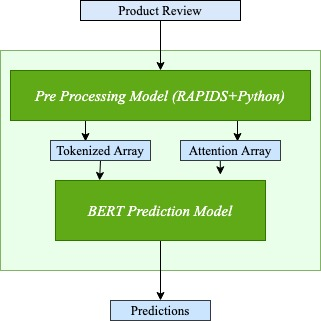

# Triton + Rapids Example

## Triton
Triton Inference Server simplifies the deployment of AI models at scale in production. It lets teams deploy trained AI models from any framework (TensorFlow, NVIDIA® TensorRT, PyTorch, ONNX Runtime, or custom) from local storage or cloud platform on any GPU- or CPU-based infrastructure (cloud, data center, or edge) and deploy them on the cloud. 

Check out the Triton documentation at [link](https://github.com/triton-inference-server/server/blob/r21.04/README.md#documentation)

# Using Rapids and Triton together

We use Triton's [python backend](https://github.com/triton-inference-server/python_backend), which allows you to serve Python "models" that can execute arbitrary python (and thus RAPIDS) code.

Here we showcase a simple example of using RAPIDS+Pytorch with Triton.

## Build 

[build.sh](build.sh) creates a Triton+RAPIDS docker container which you can use to deploy your rapids code with Triton.  

```bash
bash build.sh
```


## Model 



1. Tokenization of strings  into numerical vectors using `cuDF's subwordTokenizer.`

    - Tokenization model code is present in [models/rapids_tokenizer/1/model.py](models/rapids_tokenizer/1/model.py)
    - Tokenization model configuration is defined in [models/rapids_tokenizer/config.pbtxt](models/rapids_tokenizer/config.pbtxt)

2. Sentiment Prediction using Pytorch model

    - Sentiment model code is present in [models/sentiment_analysis_model/1/model.py](models/sentiment_analysis_model/1/model.py)
    - Sentiment model configuration is defined in [models/sentiment_analysis_model/config.pbtxt](models/sentiment_analysis_model/config.pbtxt)


3. Ensemble Model Configuration is present in [models/end_to_end_model/config.pbtxt](models/end_to_end_model/config.pbtxt)


## Serving
Triton inference server is started using [start_server.sh](start_server.sh). 

```bash
bash start_server.sh
```


### Client Code
The client logic to interact with the served Triton model is present in [example_client.ipynb](example_client.ipynb). 
