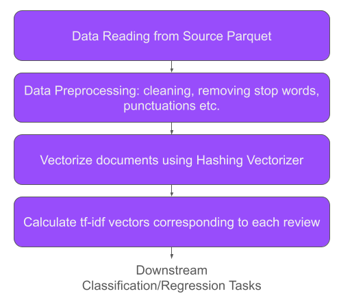
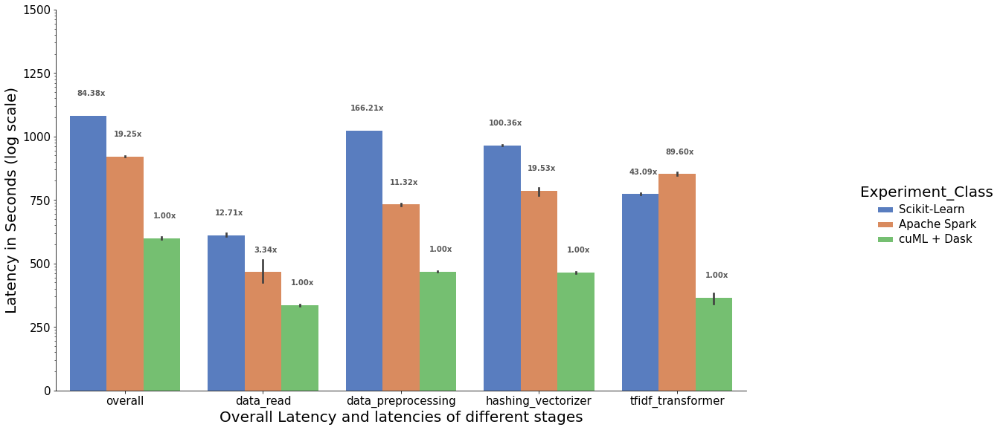

## Benchmarking the latency of a NLP tf-idf pipeline across Sklearn, cuML and Spark using Hashing Vectorizer. 

**Note:** All tests are done on a bare-metal server with RAPIDS 21.08a conda environment. The PySpark version we have used is 3.1.2.

### Dataset
For the study, we have used a subset of the [Amazon Customer Reviews Dataset](https://s3.amazonaws.com/amazon-reviews-pds/readme.html), which is a dataset of customer reviews of products available on the Amazon platform. We particularly use only the reviews of PC products in this study (no particular reason). While the data is available in both tab separated (`tsv`) and `parquet` file format, we will use the parquet file format here. For the test however, downloading the parquet files in the notebook is extremely slow. Hence we have downloaded the parquet files in the DGX box before running the tests and then read from disk in the notebooks.

The dataset can be downloaded locally by the following (assuming you have `aws-cli` set up):
```
aws s3 cp s3://amazon-reviews-pds/parquet/product_category=Books/ ./data/product_category=Books/ --recursive
```
The size of the compressed parquet files on disk is ~11GB. The total number of rows with reviews is around 21 million (20,725,971). 

We have the following 3 notebooks for this benchmark:
1. [`NLP-pipeline-sklearn.ipynb`](./NLP-pipeline-sklearn.ipynb) is the standard single CPU `sklearn` pipeline. 
2. [`NLP-pipeline-spark.ipynb`](./NLP-pipeline-spark.ipynb) is the multi CPU `spark` pipeline. 
3. [`NLP-pipeline-cuML.ipynb`](./NLP-pipeline-cuML.ipynb) is the standard multi GPU `cuML` pipeline leveraging Dask. We also perform a  strong scaling test using 2, 4, 6 and 8 (32GB V100) GPUs on a single DGX box.

### System Setup
We test all of the 3 pipelines in an NVIDIA DGX box with 8x 32GB V100 GPUs, 80 virtual cores (40 physical cores) and 1TB system memory. 

- **scikit-learn**: Scikit will leverage only the CPUs using rudimentary parallelism. We primarily use this as a baseline. 
- **Apache Spark**: We allow the Spark cluster to use all the 80 (Intel Xeon E5-2698) virtual CPU cores of the DGX box and all available memory. Note: the dataset is obviously much much smaller than the system memory. 
- **cuML + Dask**: For the benchmark comparison, we allocate 6x V100 GPUs to our local Dask cuda cluster. Further, for the strong scaling performance testing, we allocate 2,4,6,and 8 GPUs for separate runs. In Dask, we configure each worker to have a single GPU. So with 6 GPUs allocated to the Dask cluster, we would have 6 workers, each with a single GPU.  

Note: All tests are done on a bare-metal server with RAPIDS 21.08a conda environment (https://rapids.ai/start.html) . The PySpark version we have used is 3.1.2.

### Benchmark Code Setup
The general workflow across all the 3 pipelines look like the following. We are only interested in benchmarking the blocks in <span style="color:#984dfb">**purple**</span> in this study. Stay tuned for our future posts for benchmarking of downstream classification/regression tasks as well. 


### Some considerations during benchmarking
*You should be careful while benchmarking lazy evaluations.*

Apache Spark uses lazy evaluation. This means that until some action or compute step is encountered, no processing will trigger internally. Therefore, if we want to isolate the latencies of the intermediate stages, we would need to trigger computation at the end of each of those stages and then adjust the results accordingly.

For Spark, this is especially tricky since `df.count()`, `df.rdd.count()` or `df.save.parquet()` etc. actions have their own overheads as well as optimizations which becomes difficult to account for during benchmarking. Fortunately, in Apache Spark 3.0 onwards, the noop write format is introduced to help in benchmarking and remove i/o overhead. If we specify `noop` as the write format, Spark will materialize the query and trigger the action, but it will not write the result anywhere.
```python
(data.write.format("noop").mode("overwrite").save())
```
However, one thing to note here is that since the latency of one stage will include the latency of the entire DAG up-to that stage, we have to isolate latency of one stage by subtracting out the latency upto the previous stage.


---
### Results
The following are some numbers:

|                      | Overall End to End (s) | Data Read (s)       | Data Preprocessing (s) | Hashing Vectorizer (s) | Tf-idf Transformer (s) | Sample Runs |
|----------------------|:------------------:|-----------------|--------------------|--------------------|--------------------|-----------------|
| Scikit-Learn         | 2115.102 &#177; 11.36  | 27.855 &#177; 1.564 | 1241.118 &#177; 1.476  | 722.189 &#177; 8.656   | 123.780 &#177; 3.381   | 3               |
| Apache Spark         | 482.556 &#177; 7.499   | 7.324 &#177; 4.444  | 84.52 &#177; 4.60      | 140.562 &#177; 26.04   | 257.355 &#177; 19.288  | 5               |
| cuML + Dask 6GPUs | 25.058 &#177; 1.170    | 2.142 &#177; 0.093  | 7.467 &#177; 0.227     | 7.196 &#177; 0.276     | 2.872 &#177; 0.690     | 5               |

---

Comparing the end to end latency between Apache Spark and cuML + Dask pipeline, we see a **19.25x** speedup with the latter with just 6 GPUs !! 😎 😎 

**Note:** The Y-axis is in log scale.



#### Bonus:
As expected, we find that the pipeline using cuML + Dask, speeds up almost linearly with the increase in number of GPUs. We observe that the end-to-end latency goes down linearly with increasing the number of GPUs (n_workers) upto 8 GPUs. Further scaling may be achieved with multiple nodes in the Dask cluster.


